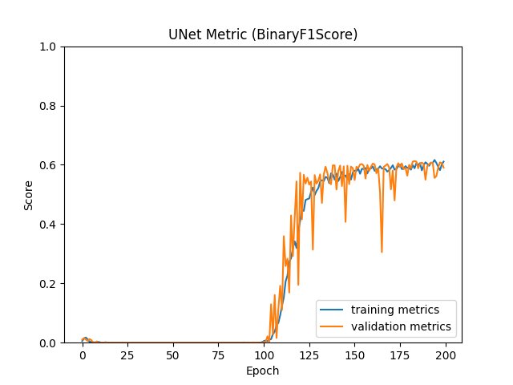
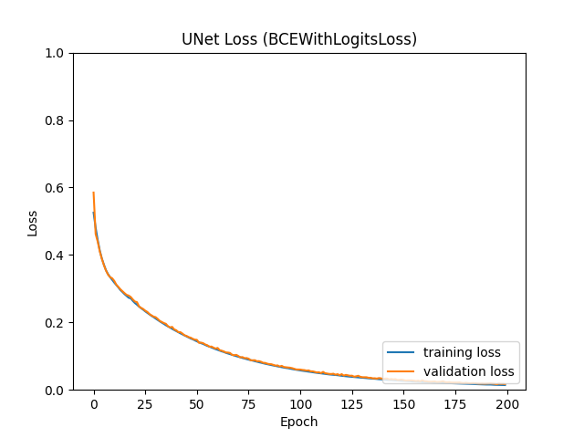

# Tent Detection
The output.zip file contains the models and predictions generated by Tent Detector 2023, along with some metrics.

# Sarpol Zahab Tents Dataset

The dataset used in this research is created by [Ghassem Tofighi](https://ghassem.com) and [Ali Asgary](https://profiles.laps.yorku.ca/profiles/asgary/) taken from [here](https://github.com/tofighi/sarpol-zahab-tents)

# UNet Performance

